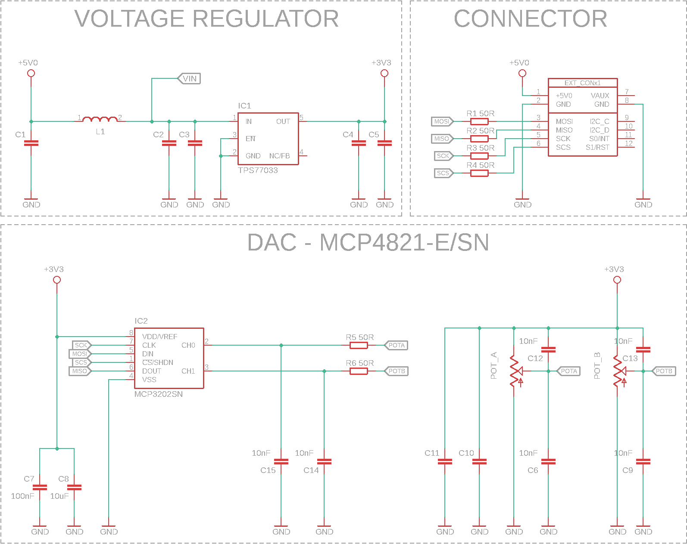
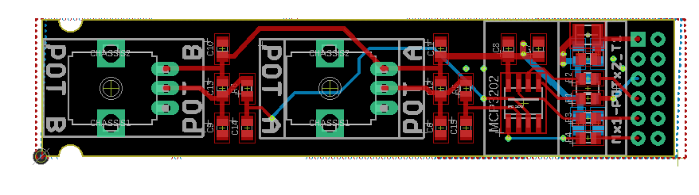

# Dual Potentiometer Module with ATtiny48 and MCP3202 ADC

## Overview
This repository contains the design and implementation details of a Dual Potentiometer Module, integrating two distinct potentiometers with an MCP3202 ADC for precise analog-to-digital conversion. Designed for smartboard system expansions, it connects via a single smartboard connector and supports precise parameter control for a wide range of applications.

## Key Features
- **Variable Resistance Potentiometer**: Smooth, continuous rotation from 0 to maximum resistance, suitable for volume or intensity control.
- **Center-Detent Potentiometer**: Features a tactile midpoint for easy balance or center-value setting, ideal for parameters requiring deviation from a central point (e.g., left-right, negative-positive adjustments).
- **MCP3202 ADC**: A 12-bit Analog-to-Digital Converter (ADC) with SPI interface for high precision analog signal conversion, enhancing the module's accuracy and reliability.
- **SPI Communication**: Facilitates robust and versatile communication through the Serial Peripheral Interface (SPI), ensuring reliable data transfer between the ADC and any connected smartboard system.
- **Smartboard Compatibility**: Easily integrates with smartboard systems through a dedicated connector.
- **Ease of Programming**: Direct programming and configuration via connector signals.

### MCP3202 ADC
The MCP3202 ADC is an integral part of this module, offering high-resolution, 12-bit analog-to-digital conversion. It features two analog input channels, perfect for reading the positions of the potentiometers. The ADC communicates with the ATtiny48 microcontroller via SPI, ensuring accurate and swift data transfer for real-time adjustments. Detailed information about the MCP3202 ADC can be found in the [documentation](media/21034F-64776.pdf).

### Schematic and Board Design

*The schematic provides a comprehensive view of the circuit design, illustrating the integration of the potentiometers, ATtiny48 microcontroller, and MCP3202 ADC.*

*This image shows the PCB layout, highlighting the placement of components such as the potentiometers, ATtiny48, and MCP3202 ADC, giving a clear overview of the design.*

## Contributions and Feedback
Contributions to this project are welcome. If you have improvement suggestions or have developed new features, please fork the repository, implement your changes, and submit a pull request. For questions or issues, feel free to open an issue in the GitHub repository.

## License
This project is licensed under the MIT License. You are free to use, modify, and distribute this design in both private and commercial settings. Attribution to the original author, Adam Łuczak, is appreciated but not required. The project is provided "as is", without warranty of any kind.

For the complete terms, please refer to the MIT License documentation.

## Contact
For inquiries or suggestions regarding this project, please contact Adam Łuczak at adam.luczak@outlook.com.
